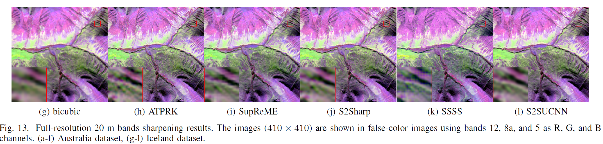
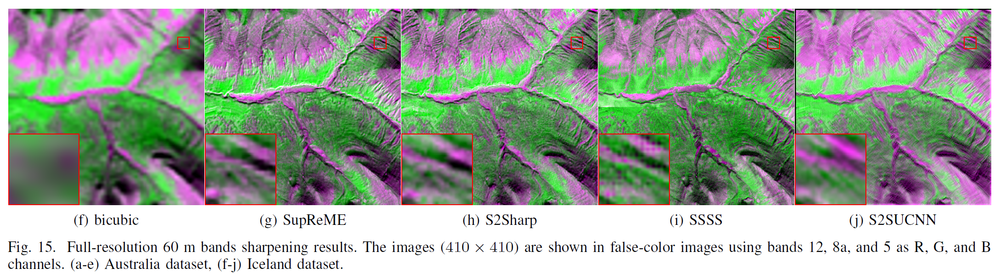

# S2S_UCNN
 Official Pythong codes for the paper "Sentinel 2 sharpening using a single unsupervised convolutional neural network", publised in *IEEE Journal of Selected Topics in Applied Earth Observations and Remote Sensing*, Vol 14, 2021, pp. 6882-6896.  
**Authors**: Han V. Nguyen $^\ast$, Magnus O. Ulfarsson $^\ast$,  Johannes R. Sveinsson $^\ast$, and Mauro Dalla Mura $^\dagger$  
$^\ast$ Faculty of Electrical and Computer Engineering, University of Iceland, Reykjavik, Iceland 
$^\dagger$ GIPSA-Lab, Grenoble Institute of Technology, Saint Martin d’Hères, France. 
Email: hvn2@hi.is

**Please cite our work if you are interested**

 @article{nguyen2021sentinel,
  title={Sentinel-2 Sharpening Using a Single Unsupervised Convolutional Neural Network With MTF-Based Degradation Model},
  author={Nguyen, Han V and Ulfarsson, Magnus O and Sveinsson, Johannes R and Dalla Mura, Mauro},
  journal={IEEE Journal of Selected Topics in Applied Earth Observations and Remote Sensing},
  volume={14},
  pages={6882--6896},
  year={2021},
  publisher={IEEE}
}

@inproceedings{nguyen2021S2sharpening,
  title={Sharpening the 20 m bands of Sentinel-2 image using an unsupervised Convolutional Neural Network},
  author={Nguyen, Han V and Ulfarsson, Magnus O and Sveinsson, Johannes R},
  booktitle={Proc. IEEE Geosci. Remote Sens. Symp},
  year={2021}
}

## Abstract
The Sentinel-2 (S2) constellation provides multispectral images at 10 m, 20 m, and 60 m resolution bands. Obtaining all bands at 10 m resolution would benefit many applications. Recently, many model-based and deep learning (DL)-based sharpening methods have been proposed. However, the downside of those methods is that the DL-based methods need to be trained separately for the 20 m and the 60 m bands in a supervised manner at reduced-resolution, while the model-based methods heavily depend on the hand-crafted image priors. To break the gap, this paper proposes a novel unsupervised DL-based S2 sharpening method using a single convolutional neural network (CNN) to sharpen the 20 m and 60 m bands at the same time at full-resolution. The proposed method replaces the hand-crafted image prior by the deep image prior (DIP) provided by a CNN structure whose parameters are easily optimized using a DL optimizer. We also incorporate the modulation transfer function (MTF)-based degradation model as a network layer, and add all bands to both network input and output. This setting improves the DIP and exploits the advantage of multitask learning since all S2 bands are highly correlated. Extensive experiments with real S2 data show that our proposed method outperforms competitive methods for reduced-resolution evaluation and yields very high quality sharpened image for full-resolution evaluation.

## Usage:
 - Run the jupyter notebook file and see the results.
     + The file *S2SingleNet-Final-RR* is for the reduced-resolution evaluation
     + The file *S2SingleNet-Final-FF* is for full-resolution evaluation
 - Data (preprocessing in Matlab) are in folder *data*
     + A matlab file contains y10, y20, and y60 which are the 10 m, 20 m, and 60 m, respectively.
 - CNN models are in folder *models*
 - Some helped functions are in the folder *utils*

## Enviroment:
- Tensorflow 2.1
- Numpy
- Scipy, Skimage

## Results
- **Reduced resolution evaluation**

- **Full resolution evaluation**

